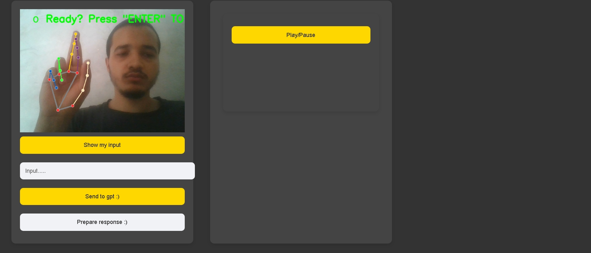
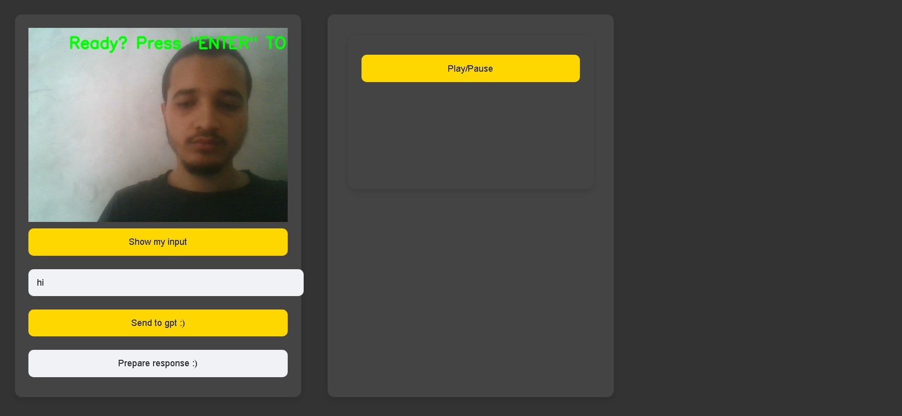
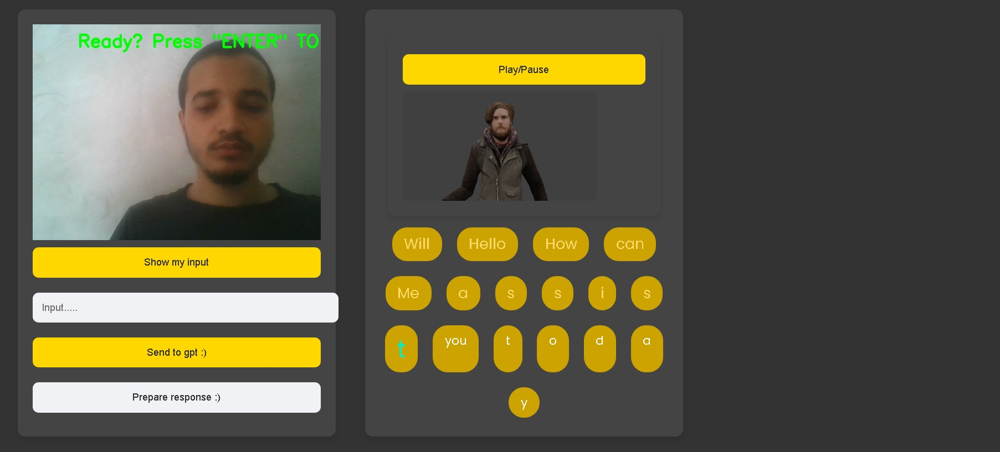

# Project Title Sign Language for learning purpose
the first fonctionalite consiste of adding the translation of learning resources videos,books.... with sign language explained in animation ,this is demo video that explain it....:

    
This is the second fonctionalite of the project openai chatbot with sign language input and resposne # output # with sign language animation.

## Images

  

